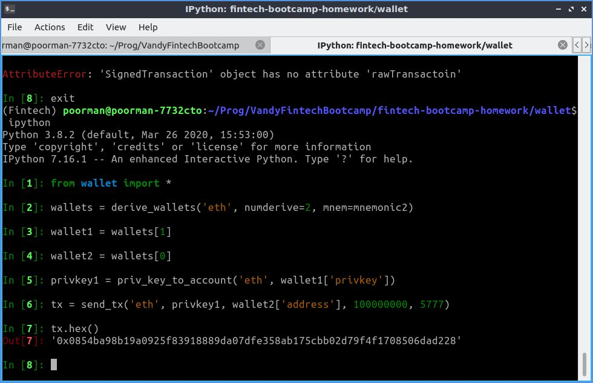

# Multi-blockchain wallet in Python

## Overview

In this project we use Python to derive BTC-test and ETH wallets from a mnemonic and 
send transactions programmatically.

BIP32, BIP39 and BIP44 are "Bitcoin Improvement Proposals" that allow addresses to be derived from a mnemonic (a string of random English words). The derivation is deterministic, so starting with a given mnemonic you can always derive the same addresses.

## Code functionality

The code is composed of four functions: `derive_wallets`, `priv_key_to_account`, `create_tx` and `send_tx`.

First we have to derive our wallet(s). `hd-wallet-derive` is a PHP library that performs this derivation. We use a Python built-in module called `subprocess` to call `hd-wallet-derive` from inside our Python function `derive_wallets`. For our purposes, we can derive 'btc-test' or 'eth' wallets.

Next we use `priv_key_to_account` to create an account object from the private key(s) associated with the wallet(s) we just generated. The account object lets us sign transactions before sending them.

Finally, we can call `send_tx` to broadcast a transaction to the (test) network. `send_tx` first makes a call to `create_tx`, which estimates the gas cost (for ETH transactions) and builds a transaction object that the network recognizes. The transaction is then broadcast and, if it succeeds, we get back a response containing, among other things, the transaction ID, which we can use to look up the transaction on a blockchain explorer like bitaps.com.

# Requirements

To use `hd-wallet-derive`, the following packages need to be installed:
- php
- php-gmp
- php-mcrypt
- php-mbstring

Then `hd-wallet-derive` can be installed via a command line with the following commands:
- git clone https://github.com/dan-da/hd-wallet-derive
- cd hd-wallet-derive
- php -r "readfile('https://getcomposer.org/installer');" | php
- php composer.phar install

To run the code in `wallet.py`, the packages found in `requirements.txt` must be installed. A Conda environment with the required packages can be created with `conda create --name NEWENV --file requirements.txt`, where `NEWENV` is the name you wish to give to the environment.

Upon activating the environment (`conda activate NEWENV`) and starting a python shell, the modules and functions in `wallet.py` can be imported and executed.